# Diagram A — Production Stable

**Status:** DRAFT v1 (2026-04-15)
**Scope:** MasterCalendar ecosystem in production
**Audience:** Toby (primary), team personas (reference)
**Sources:** code scan (Explore agent 2026-04-15) + Sarah confirmations (2026-04-15 06:12), pending Fulton
**Tags:** `(inferred)` marks items derived from code scan without owner confirmation

---

## Diagram

```mermaid
flowchart TB

  %% ========= USERS =========
  subgraph USERS["👥 Users"]
    direction TB
    anon["Anonymous<br/>visitor"]
    auth["Authenticated<br/>NU · RO · Milonguero · Organizer · SA"]
  end

  %% ========= FRONTEND (Vercel) =========
  subgraph FE["Frontend — Vercel (PROD)"]
    direction LR
    TT["<b>tangotiempo.com</b><br/>Next.js 14.2 · App Router<br/>appId=1 · Node 22"]
    HJ["<b>harmonyjunction.org</b><br/>Next.js 14.2 · App Router<br/>appId=2 · Node 20"]
    CO["<b>calops</b><br/>Next.js 14.2 · Admin<br/>Node 18+"]
  end

  %% ========= BACKEND (Azure Functions) =========
  subgraph BE["Backend — Azure Functions v4"]
    direction LR
    BEPROD["<b>calendarbeaf-prod</b><br/>East US · primary"]
    BE2["<b>calendarbeaf-prod-2</b><br/>West US 2 · failover<br/>(mechanism: inferred)"]
    LEGACY["<s>calendarbe-prod</s><br/>legacy Express BE<br/>(inferred: retired)"]
  end

  %% ========= AUTH =========
  subgraph AUTH["🔐 Auth — Firebase"]
    FB["tangotiempo-257ff<br/>single project<br/>shared by appId=1 + appId=2"]
  end

  %% ========= DATA =========
  subgraph DATA["💾 Data — MongoDB Atlas"]
    MONGO[("Single cluster<br/>DB: TangoTiempoProd<br/>all queries filter by appId<br/>(inferred: tier + region)")]
  end

  %% ========= EXTERNAL (Browser-side) =========
  subgraph EXTFE["🌐 External — Browser-side"]
    direction TB
    MAPBOX["Mapbox<br/>geocoding · maps"]
    GGEO["Google Maps<br/>geocoding API"]
    GA["Google Analytics"]
    CLOUD["Cloudinary<br/>image hosting"]
  end

  %% ========= EXTERNAL (BE-side) =========
  subgraph EXTBE["🤖 External — BE-side"]
    direction TB
    OPENAI["OpenAI<br/>text + TTS"]
    GMAPS_BE["Google Maps API<br/>server-side"]
    MAPBOX_BE["Mapbox<br/>reverse geo"]
    SB["Azure Service Bus<br/>(inferred: use?)"]
    BLOB["Azure Storage Blob<br/>(inferred: use?)"]
    COSMOS["Azure Cosmos DB<br/>(inferred: alt data path?)"]
    AI_INS["App Insights<br/>telemetry"]
  end

  %% ========= CONNECTIONS =========
  anon --> TT
  anon --> HJ
  auth --> TT
  auth --> HJ
  auth --> CO

  TT -->|"login / token"| FB
  HJ -->|"login / token"| FB
  CO -->|"login / token"| FB

  TT -->|"NEXT_PUBLIC_BE_URL<br/>REST over HTTPS"| BEPROD
  HJ -->|"REST"| BEPROD
  CO -->|"REST"| BEPROD

  BEPROD -. "failover<br/>(mechanism TBD)" .-> BE2

  BEPROD -->|"verify Bearer token"| FB
  BE2 -->|"verify Bearer token"| FB

  BEPROD -->|"Mongoose / native driver"| MONGO
  BE2 -->|"read-only during failover?<br/>(inferred)"| MONGO

  TT --> MAPBOX
  TT --> GGEO
  TT --> GA
  TT --> CLOUD
  HJ --> MAPBOX
  HJ --> GGEO
  HJ --> GA
  HJ --> CLOUD
  CO --> GGEO

  BEPROD --> OPENAI
  BEPROD --> GMAPS_BE
  BEPROD --> MAPBOX_BE
  BEPROD -. inferred .-> SB
  BEPROD -. inferred .-> BLOB
  BEPROD -. inferred .-> COSMOS
  BEPROD --> AI_INS
  BE2 --> AI_INS

  %% ========= STYLES =========
  classDef usergroup fill:#fef3c7,stroke:#f59e0b,stroke-width:2px
  classDef fe fill:#dbeafe,stroke:#3b82f6,stroke-width:2px
  classDef be fill:#dcfce7,stroke:#16a34a,stroke-width:2px
  classDef data fill:#ede9fe,stroke:#8b5cf6,stroke-width:2px
  classDef auth fill:#fce7f3,stroke:#ec4899,stroke-width:2px
  classDef ext fill:#f3f4f6,stroke:#6b7280,stroke-width:1px,stroke-dasharray: 5 5
  classDef deprecated fill:#fee2e2,stroke:#dc2626,stroke-dasharray: 3 3

  class anon,auth usergroup
  class TT,HJ,CO fe
  class BEPROD,BE2 be
  class LEGACY deprecated
  class MONGO data
  class FB auth
  class MAPBOX,GGEO,GA,CLOUD,OPENAI,GMAPS_BE,MAPBOX_BE,SB,BLOB,COSMOS,AI_INS ext
```

---

## Key facts (confirmed from code scan)

| Layer | Component | Detail |
|-------|-----------|--------|
| Frontend host | Vercel | All 3 frontends (TT, HJ, CalOps); PROD deploys manual (`vercel --prod`) |
| Frontend framework | Next.js 14.2.35 | App Router; Node 18–22 across apps |
| appId model | Shared BE + appId filter | `appId=1` (TT), `appId=2` (HJ); all DB queries filter by appId |
| BE host | Azure Functions v4 | Route prefix `/api`, 5-min timeout, CORS wildcard (`host.json`) |
| BE regions | East US + West US 2 | PROD primary + PROD-2 failover |
| Database | MongoDB Atlas | Single cluster, `TangoTiempoProd` DB for prod; appId-scoped queries |
| Auth | Firebase (`tangotiempo-257ff`) | One project shared by both appIds |
| Image hosting | Cloudinary | Browser-side |
| Maps / geo | Mapbox + Google (dual) | Frontend + BE both use |
| AI / LLM | OpenAI | Server-side (text + TTS) |
| Telemetry | Azure App Insights | All BE apps |

---

## Open items flagged `(inferred)` — need owner confirmation

| # | Item | Why flagged | Owner to confirm |
|---|------|-------------|------------------|
| 1 | PROD-2 West US 2 failover mechanism | Workflows exist but cutover method (Front Door / DNS / manual) not in code | Fulton |
| 2 | MongoDB cluster tier (M0/M2/M10), region, connection pool max | Atlas settings not in repo | Fulton |
| 3 | Whether PROD-2 serves writes, reads-only, or hot-standby | Inferred as failover; not explicit | Fulton |
| 4 | Whether Azure Service Bus / Blob / Cosmos DB are actively used | Packages imported; call sites may be legacy | Fulton |
| 5 | Legacy Express BE (`calendarbe-prod-a7b3ahe3bteqa6a7`) — fully retired or dark traffic? | `.env.example` still references | Fulton |
| ~~6~~ | Vercel team owner + Vercel projects | **Confirmed:** account owner `ybotman`; prod project `tangotiempo-com` (previews DEPROVISIONED); test project `tangotiempo-test` (builds all non-PROD branch previews) | ✅ Sarah |
| ~~7~~ | Browser-side externals | **Confirmed:** Mapbox, Google Static Maps (AI mini-maps only), GA (G-6KGB3S21KH), Cloudinary, Firebase. **NO** Sentry/LogRocket/Stripe | ✅ Sarah |
| 8 | App Insights: one instance for all BE, or per-env? | Not configured in repo | Fulton |

---

## Style notes (for your review before I batch B + C)

- **Subgraph grouping** by tier (users, FE, BE, auth, data, external split BE vs FE)
- **Color coding**: users=amber, FE=blue, BE=green, data=purple, auth=pink, external=grey-dashed
- **Dashed lines** = uncertain / inferred relationships
- **Strikethrough** = deprecated (legacy Express BE)
- **External services split** browser-side vs BE-side — important for showing attack surface + cost centers separately

If the style works, B (CI/CD) and C (Stack connectivity) will follow the same vocabulary. If you want changes (different colors, more/less detail, different grouping), say so before I batch the other two.

---

## How to view

- GitHub preview renders Mermaid natively — push this file and click in the web UI
- Local render to PNG: `brew install mermaid-cli` → `mmdc -i A-production-stable.md -o A-production-stable.png`
- VSCode: install "Markdown Preview Mermaid Support" extension

---

*Next: Diagram B (Dev CI/CD + promotions) and Diagram C (Stack connectivity) pending style approval.*
